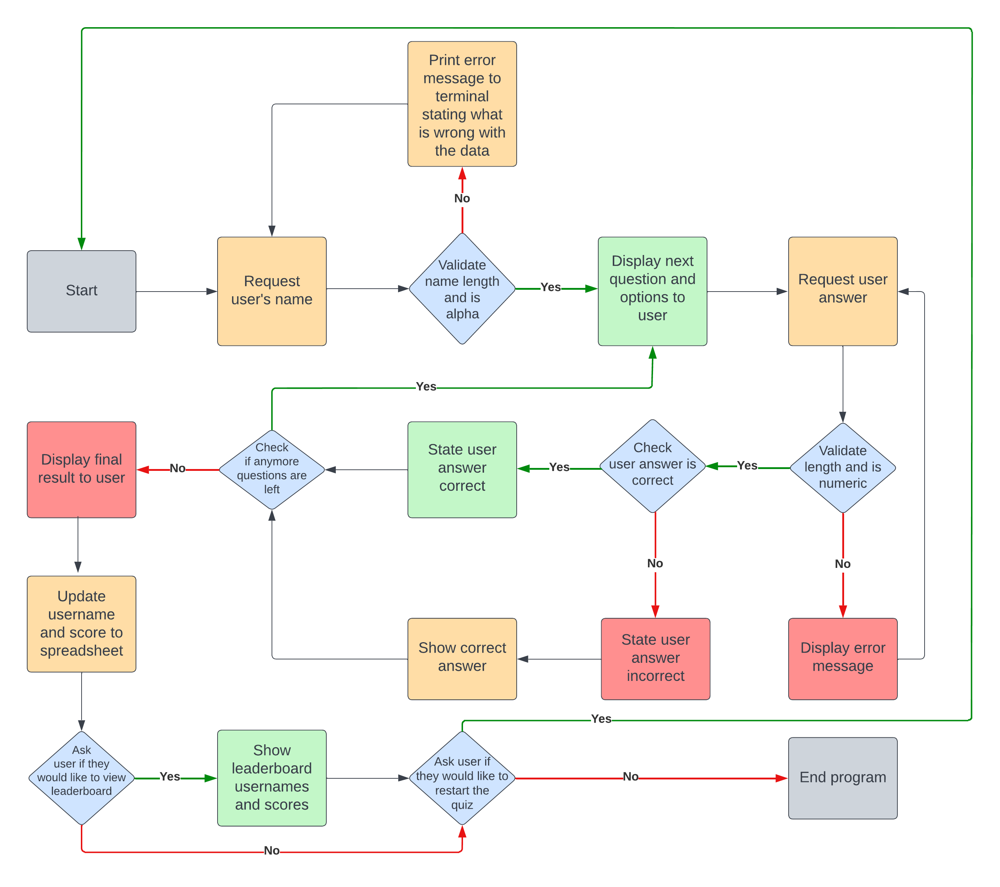
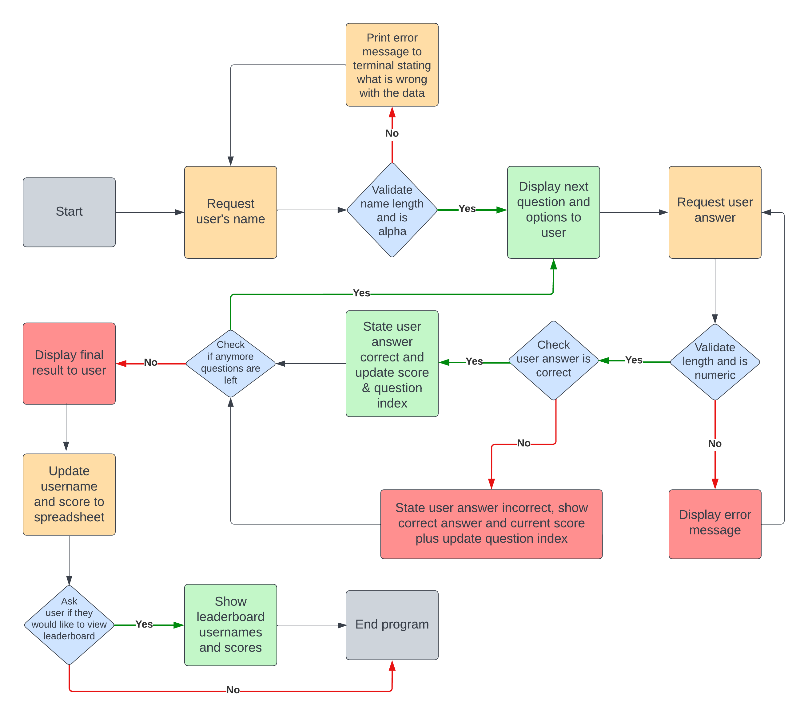

# KC-7's Quiz (built using Python)

## Live Links: 

* Heroku App: https://kc-quiz.herokuapp.com/
* Google Spreadsheet: https://docs.google.com/spreadsheets/d/1gO0uQxTMf_DukHugL-Vmi94pZnGUBhMNTlDku29Pp5s/edit?usp=sharing

## About:

This terminal quiz app was built using Python to demonstrate a wide range of different functions.
The quiz takes the user's name, provides a series of questions and options and provides a final result at the end of the quiz.
Each user input is validated to ensure the data is in the correct format.
A google spreadsheet is linked to the app to keep track of the usernames and scores, the info is sent on completion of the quiz. 
The user will be given an option to print the high scores leaderboard to the terminal at the end of the game. The high scores are sorted in the google spreadsheet.

## Table of Contents:

- [Technologies](#technologies)
- [How to Play](#how-to-play)

## Technologies: 🌐 🛠 

- **Python** - was used to program the quiz  app. 

- **The Code Institute Python Template** - was used to create the terminal web app. 

- **GitPod** - is the platform used to develop the site. 

- **GitHub** - is used to host the files. 

- **Heroku** - was used to deploy and host the web app.  

- **Markdown** - is used to format the readme file. 

- **Google Sheets** - is used to save the username and score & to display the leaderboard. 

## How to Play: 🎲 🎮

- The quiz application is terminal based. 
- The user must input the required information (such as username, answer and yes or no) into the terminal when requested.
- The quiz will validate user inputs as to avoid issues. 

- The user will be asked to enter their username at the start of the quiz, this will be validated to ensure the input is the correct length and alphabetical. If the input is invalid, an error will be shown and the user will be asked to enter their username again. 
- The first question and corrosponding options will be displayed to the user.
- The user will be asked to input the number of the corrosponding option they would like to select as their answer. 
- The user will be given an option to view the high score leaderboard. 
- The user will be shown the leader board if they select yes, if not they will terminate the app. If the user's input is not valid, the question will be repeated. 
- The app will terminate after the user has viewed the leaderboard and they can replay by selecting the "Run Program" button above the terminal window again. 

## Features: 💻

⏹ 🔄 🔤 ❓ 🖱 🎰 ✅ ❌

### Welcome Screen 👋 ⏯

### Question Screen ❓ 🖱

### Result Screen 🎰 ✅ ❌

### End Screen ⏹ 🔄

### Future Features: 🆕

- **Additional difficulty levels** could be set up asking the user an array of more difficult questions. 💬

## Planning & Design ✍ 🆒

- The site was designed using Python. 

- The site was intially designed using the below flowchart with the view of implementing additional features:

- The app was adjusted and I created the below flowchart to reflect: 

- Additional changes were made and the **Final Flowchart** was updated again to reflect this:

________________

## Testing: 

### Test Cases 🕵

#### 1. Welcome Text:

| **Test** | **Expectation** | **Result** |
| ------- | ------- | ------- |
| Go to https://kc-quiz.herokuapp.com/ and click the "Run Program" button. | Web page should load and when the "Run Program" button is pressed, the the welcome screen text and ascii logo will be displayed on the terminal app. The logo should have magenta text and cyan background, all other text should be white. | ✅ Worked as expected |

WELCOME IMAGE HERE

#### 2. Username Text & Input Section:

| **Test** | **Expectation** | **Result** |
| ------- | ------- | ------- |
| Press Enter to continue. | The previous text should clear. It will display the username ascii heading in magenta. It will list username requirements and then prompt the user to input their data. | ✅ Worked as expected |

IMAGE HERE

#### 3. Invalid Username Input Section:

| **Test** | **Expectation** | **Result** |
| ------- | ------- | ------- |
| Enter invalid usernames testing min (2) & max (8) length and data is alpahetical, eg: "T", "TTTTTTTTTT" & "11111" | The previous text should clear. It will display the invalid username section and request input again by looping back to the Username Input Section. The username ascii header should be displayed in magenta above the error text and username request. | ✅ Worked as expected |

IMAGE HERE

#### 4. How to Play Section (Username Valid):

| **Test** | **Expectation** | **Result** |
| ------- | ------- | ------- |
| Enter a valid username containing alphabetic letters between 2 & 8 characters in length, eg: "Tony". | The previous text should clear. It will display the How To Play section section which should welcome the user with the name they entered and then state help text on how to play. The How To Play ascii header and user's name should be displayed in magenta, all other text in white. | ✅ Worked as expected |

IMAGE HERE

#### 5. Questions Section:

| **Test** | **Expectation** | **Result** |
| ------- | ------- | ------- |
| Press Enter to continue. | The previous text should clear. It will display the first question in magenta, the question and options in cyan and then request user input in white. Verify that the Question Index and Total Number of Questions are being displayed correctly in the the title, eg: 1 of 6. | ✅ Worked as expected |

IMAGE HERE

#### 6. Ivalid Question Input Section:

| **Test** | **Expectation** | **Result** |
| ------- | ------- | ------- |
| Enter an invalid input, i.e. 0, a number greater than the number of corrosponding options asked or alphabetic letters. | The previous text should **NOT** clear. It will display the user's input data in red. It will clarify input requirments and loop the Question Input.  | ✅ Worked as expected |

IMAGE HERE

#### 7. Correct Answer Section:

| **Test** | **Expectation** | **Result** |
| ------- | ------- | ------- |
| Enter the correct answer. | The previous text should clear. It will display well done ascii art. It will congratulate the user and add 100 points to their score. It will display the user's current score. All text should be in green except the request to press Enter to continue. | ✅ Worked as expected |

IMAGE HERE

#### 8. Question Section Loop:

| **Test** | **Expectation** | **Result** |
| ------- | ------- | ------- |
| Press Enter to continue. | The previous text should clear. It will display well done ascii art. It will display the next question in magenta, the question title should update to reflect this, the corrosponding question and options should be displayed in cyan and then request user input in white.| ✅ Worked as expected |

IMAGE HERE

#### 9. Ivalid Question Input Section:

| **Test** | **Expectation** | **Result** |
| ------- | ------- | ------- |
| Enter an incorrect answer. | The previous text should **NOT** clear. It will state the following in red: user answer incorrect, the correct answer, they didnt score any point and their current points score. It will request press Enter to continue in white.  | ✅ Worked as expected |

IMAGE HERE

#### 10. The End Section:

| **Test** | **Expectation** | **Result** |
| ------- | ------- | ------- |
| Complete all questions in the quiz. | The previous text should clear. It will show "The End, Your Score:" ascii header with inverted colors (white background and black text). It will congratulate the user on making it to the end of the quiz in white. It will then provide different custom messages for the user based on their score, in red if they score below 50%, yellow if 50%, and green above 50%, there is also a different message for scoring 100%, you will need to complete the quiz multiple times with different total scores to test this. It will display the final score and request press Enter to continue in white.  | ✅ Worked as expected |

IMAGE HERE

#### 11. Saved & Leaderboard Input Section:

| **Test** | **Expectation** | **Result** |
| ------- | ------- | ------- |
| Press Enter to continue.| The previous text should clear. It will save the users result to the google sheet. It will show "Saved" ascii header in green and will state their username and score has been saved, both values should be displayed to the user. It will show "Leadboard" ascii header in yellow and will ask the user if they would like to view the high score leaderboard by entering y or n. | ✅ Worked as expected |

#### 12. Invalid Leaderboard Input Section:

| **Test** | **Expectation** | **Result** |
| ------- | ------- | ------- |
| Press Enter to continue.| The previous text should clear. It will display the user's input in red and clarify requirements. It will then loop the Leaderboard Input Section again below including the Leaderboard ascii art, text and input (as in above). | ✅ Worked as expected |

IMAGE HERE

#### 13. Leaderboard Section:

| **Test** | **Expectation** | **Result** |
| ------- | ------- | ------- |
| Enter y (or Y to test it will accept both) to continue to leaderboard. | The previous text should clear. It will display the leaderboard header in yellow at the top, followed by the top 15 high scores which include the user's rank, name and score. It will inform the user that they can restart the quiz by pressing the Run Program button again. The app should no longer react to user input as it is now finished. | ✅ Worked as expected |

IMAGE HERE

#### 14. Terminate Quiz Section (No to leaderboard):

| **Test** | **Expectation** | **Result** |
| ------- | ------- | ------- |
| Enter n (or N to test it will accept both) when asked if you would like to view the leaderboard (step 12) or click enter from the leaderboard (step 13) to terminate the app. | The previous text should clear. It will display red ascii header "Terminated Game Over" and then inform the user that they can restart the quiz by selecting the Run Program button again in white text. | ✅ Worked as expected |

IMAGE HERE

### Solved Bugs & Problems: 🕵 🕷

I made some of the following changes during development to improve how the app functions / address issues: 

| **Issue** | **Solution** | **Image** |
| ------- | ------- | ------- |
| Overwhelming amount of text and no division between sections. | I imported and then used "os.system("clear")" to clear the page as appropiate to improve the user experience. | Image Goes Here |
| Test Bug Example Text | Test Bug Fix Example Text | Image Goes Here |

### Remaining Bugs: 🕵 🕷

I was not able to identify any further bugs during final testing. &#10004; 🐛 🐞 🦗

### Validator Testing: 🏸

I used Code Institute's Python Linter Heroku App (https://pep8ci.herokuapp.com/) to check for errors and received all clear results. 

IMAGE HERE

## Deployment: 🌐

### GitPod: 🔧 ⌨

- I developed the site using Python in GitPod. 

- I tested the site during development by entering the following command into the terminal: 
    - *python3 run.py*

- For version control, I regularly updated my work to **GitHub** by entering the below commands into the terminal: 
    - *git add .*
    - *git commit -m "Update message here"*
    - *git push*

### Creating the Heroku app: 🌐 🖱

- I depolyed the app to Heroku by doing the following: 
    - XXXX
    - XXXX

## Credits: 🥂 🙏

- The Code Institute's Gitpod Pyhton Terminal Window Template was used as the initial template for this project.

- The walk through project I completed with the Code Insitute, <a href="https://github.com/KC-7/love-sandwiches" target="_blank" rel="noopener" aria-label="Link to The Code Institute Walkthrough Project, Love Maths (opens in new tab)">Love Sandwiches</a>, was a good source to reference for information such as the main function. 

- I learned how to implement colours by reading pypi.org's guide to importing and using Colorama - https://pypi.org/project/colorama/

