# [KC-7's Quiz (Python Terminal App) ❔ 🔢](https://kc-quiz.herokuapp.com/)

## Live Links: 🌐

| **Site** | **Link** |
| ------- | ------- |
| Heroku App: | https://kc-quiz.herokuapp.com/ |
| Google Spreadsheet: | https://docs.google.com/spreadsheets/d/1gO0uQxTMf_DukHugL-Vmi94pZnGUBhMNTlDku29Pp5s/edit?usp=sharing |

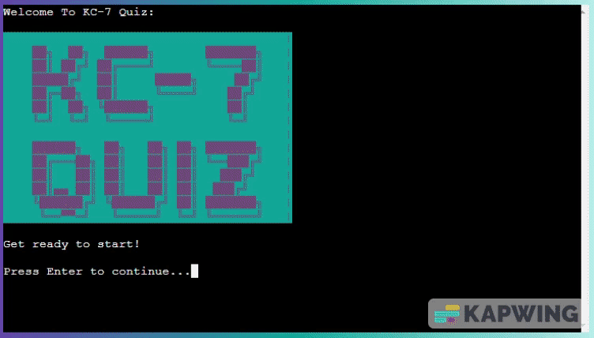

________________

## About: 📜

This terminal quiz app was built using Python to demonstrate a wide range of different functions.
The quiz takes the user's name, provides a series of questions and options and provides a final result at the end of the quiz.
Each user input is validated to ensure the data is in the correct format.
A google spreadsheet is linked to the app to keep track of the usernames and scores, the info is sent on completion of the quiz. 
The user will be given an option to print the high scores leaderboard to the terminal at the end of the game. The high scores are extracted from the google spreadsheet.

________________

## Table of Contents: 📗

  * [Live Links: 🌐](#live-links-)
  * [About: 📜](#about-)
  * [Technologies: 🌐 🛠 ](#technologies--)
    + [Libraries:  🌐 📗](#libraries---)
  * [Project Goals: 🎯 🏁](#project-goals--)
  * [User Experience: 👪](#user-experience-)
    + [User Expectations: 👱 👩](#user-expectations--)
    + [Target Audience: 👵 👦](#target-audience--)
    + [How to Play: 🎲 🎮](#how-to-play--)
    + [User Stories: 👪](#user-stories-)
  * [Planning & Design ✍ 🆒 👾](#planning--design---)
  * [Testing the Features: 💻](#testing-the-features-)
    + [Test Cases 🕵 ](#test-cases-)
      - [1. Welcome Section: 👋 ⏯](#1-welcome-section--)
      - [2. Username Text & Input Section: 🖱 🗨](#2-username-text--input-section--)
      - [3. Invalid Username Input Section: 🛑 🖱 ⛔](#3-invalid-username-input-section---)
      - [4. How to Play Section (Username Valid): ❔ 🎮 🎲](#4-how-to-play-section-username-valid---)
      - [5. Questions Section: 🔢 ❓](#5-questions-section--)
      - [6. Ivalid Question Input Section: 🛑 🔢 ⛔](#6-ivalid-question-input-section---)
      - [7. Correct Answer Section: 🔢 ✔ ](#7-correct-answer-section--)
      - [8. Question Section Loop: 🔢 ❓ 🔁](#8-question-section-loop---)
      - [9. Wrong Answer Section: 🔢 ❌](#9-wrong-answer-section--)
      - [10. End of Quiz Results Section: 🔚 🥇 🥈 🥉 🎰](#10-end-of-quiz-results-section-----)
      - [11. Saved & Leaderboard Input Section: 💾 🏆](#11-saved--leaderboard-input-section--)
      - [12. Invalid Leaderboard Input Section: 🛑 👑 🏆 ⛔](#12-invalid-leaderboard-input-section----)
      - [13. Leaderboard Section: 👑 🥇 🥈 🥉 🏆](#13-leaderboard-section-----)
      - [14. Terminate Quiz Section (No to leaderboard): 🔚 🏁](#14-terminate-quiz-section-no-to-leaderboard--)
    + [Solved Bugs, Problems & Improvements: 🕵 🕷](#solved-bugs-problems--improvements--)
    + [Remaining Bugs: 🔎 🐛 ](#remaining-bugs--)
    + [Python Linter Testing: 🕵 🕷](#python-linter-testing--)
    + [GitPod Problems: 🔎](#gitpod-problems-)
    + [Future Improvements: 🆕 💡 💭](#future-improvements---)
  * [Deployment: 🌐](#deployment-)
    + [GitPod: 🔧 ⌨](#gitpod--)
    + [Creating the Heroku app: 🌐 🖱](#creating-the-heroku-app--)
  * [Credits: 🥂 🙏 👀](#credits---)
________________

## Technologies: 🌐 🛠 

- **Python** - was used to program the quiz  app. 

- **The Code Institute Python Template** - was used to create the terminal web app. 

- **GitPod** - is the platform used to develop the site. 

- **GitHub** - is used to host the files. 

- **Heroku** - was used to deploy and host the web app.  

- **Markdown** - is used to format the readme file. 

- **Google Sheets** - is used to save the username and score & to display the leaderboard. 

### Libraries:  🌐 📗

- os - is used to clear text from terminal.
- gspread - is used to interact with goole sheet and APIs.
- google.oauth2.service_account - is used to authenticate access.
- colorama - is used to add color to text to enchance user experience.

________________

## Project Goals: 🎯 🏁

- Create an online quiz that is user friendly to play and understand.
- Provide clear instructions so the user can easily understand what to do. 
- Keep track of the user's score and upload their result to a google sheet. 
- Provide an option to display the leaderboard.
- Improve UI by adding colours and ascii art. 
- Improve UX by adding custom print statements.
- Create clear, easy to understand and mantain Python code by utilising and learning new skills. 

 [Go Back Up to Table of Contents: 📗](#table-of-contents-)
________________

## User Experience: 👪

### User Expectations: 👱 👩

- Working quiz app
- Easy to understand instructions
- Feedback for user inputs
- Save username and score
- View other high scores

### Target Audience: 👵 👦

- There is no specific target audience for this quiz app however the user must be capable of using a PC and communicating in English. Some users with poor sight may find the ascii art headings difficult to read. 

### How to Play: 🎲 🎮

- The quiz application is terminal based. 
- The user must input the required information (such as username, answer and yes or no) into the terminal when requested.
- The quiz will validate user inputs as to avoid issues. 
- The user will be asked to enter their username at the start of the quiz, this will be validated to ensure that the input is the correct length and is alphabetical. If the input is invalid, an error message will be shown and the user will be asked to enter their username again. 
- The first question and corrosponding options will be displayed to the user.
- The user will be asked to input the number of the corrosponding option they would like to select as their answer.
- The user's answer input will be validated and if there is an issue, the user will get prompted to enter the data again correctly.
- The user will recieve a message to let them know if they answered correctly, if so, they will score 100 points, if not, they will be informed of the correct answer.
- The next question will be displayed until there are no more questions remaining, the user's input, validation check, check answer and display result process will be repeated.
- The user's final result will be displayed when the user has completed all of the questions in the quiz. 
- The user's score will be saved. 
- The user will be given an option to view the high score leaderboard. 
- The user will be shown the leader board if they select yes, if not they will terminate the app. If the user's input is not valid, the question will be repeated. 
- The app will terminate after the user has viewed the leaderboard and they can replay by selecting the "Run Program" button above the terminal window again. 

### User Stories: 👪

- I want to have an enjoyable user experience. 
- I want to see more than just text, I want to see colours and ascii art. 
- I want to clear, easily to follow instructions. I want to be able to see the rules.
- I want feedback on what I have entered. Did I enter the data correctly? Did I get the answer correct? If not, what was the correct answer? 
- I want a personalised experience, I want to see my username and personailsed statements on my results. 
- I want to be able to save my score and compete against the top scores, I want to see the top scores.

 [Go Back Up to Table of Contents: 📗](#table-of-contents-)
________________

## Planning & Design ✍ 🆒 👾

- The site was designed using Python. 

- The site was intially designed using the below flowchart with the view of implementing additional features if time permitted:

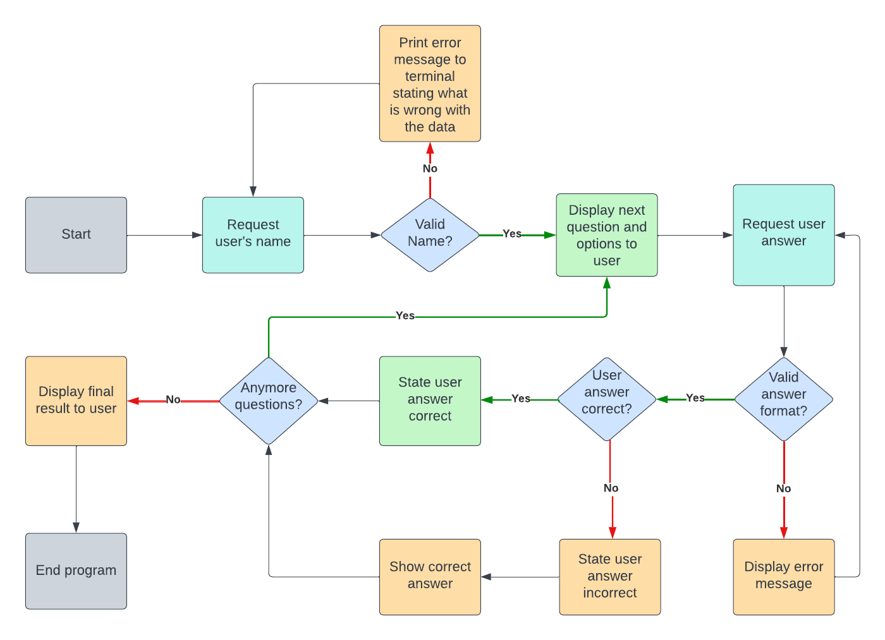

- Additional changes were made and the **Final Flowchart** was updated to reflect this:

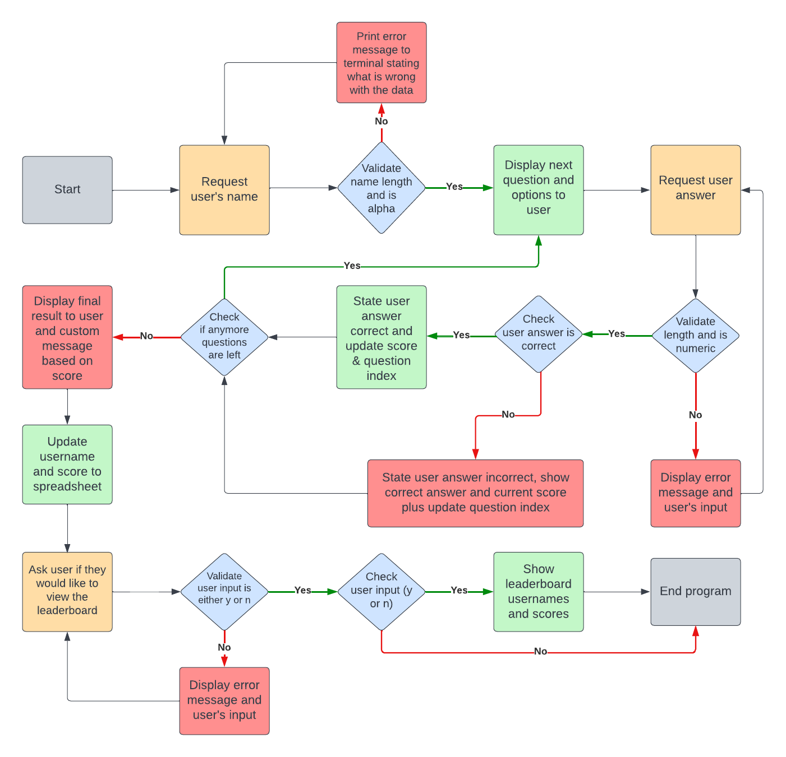

________________

## Testing the Features: 💻

### Test Cases 🕵 

#### 1. Welcome Section: 👋 ⏯

| **Test** | **Expectation** | **Result** |
| ------- | ------- | ------- |
| Go to https://kc-quiz.herokuapp.com/ | The web page should load and the welcome screen text and ascii logo will be displayed in the terminal window. The logo should have magenta text and cyan background, all other text should be white. | ✅ Worked as expected |

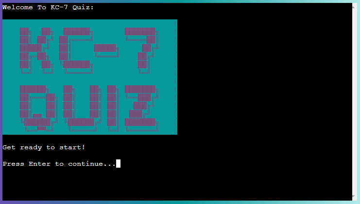

#### 2. Username Text & Input Section: 🖱 🗨

| **Test** | **Expectation** | **Result** |
| ------- | ------- | ------- |
| Click on terminal and press Enter to continue. | The previous text should clear. It will display the username & ascii heading in magenta. It will list username requirements and then prompt the user to input their data (in white). | ✅ Worked as expected |

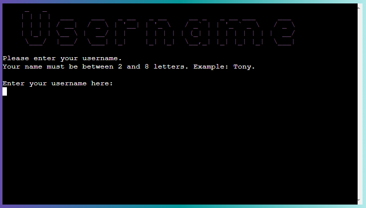

#### 3. Invalid Username Input Section: 🛑 🖱 ⛔

| **Test** | **Expectation** | **Result** |
| ------- | ------- | ------- |
| Enter invalid usernames testing min (2) & max (8) length and data is alpahetical, eg: "T", "TTTTTTTTTT" & "111" | The previous text should clear. It will display the invalid username section and request input again by looping back to the Username Input Section. The username ascii header should be displayed in magenta above the error text in red and the username request in white. | ✅ Worked as expected |

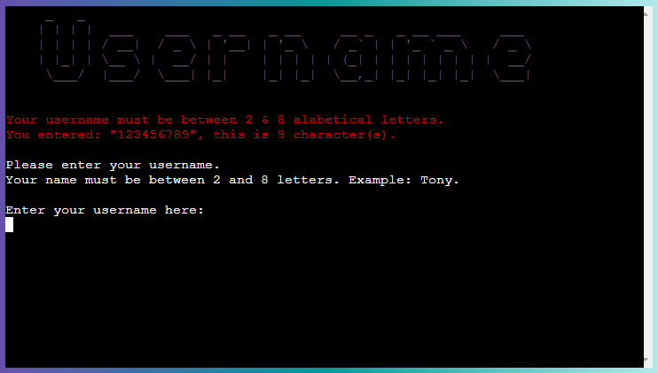

#### 4. How to Play Section (Username Valid): ❔ 🎮 🎲

| **Test** | **Expectation** | **Result** |
| ------- | ------- | ------- |
| Enter a valid username containing alphabetic letters between 2 & 8 characters in length, eg: "Tony". | The previous text should clear. It will display the How To Play section section which should greet the user with the name they entered and then state help text on how to play. The How To Play ascii header and user's name should be displayed in magenta, all other text in white. | ✅ Worked as expected |

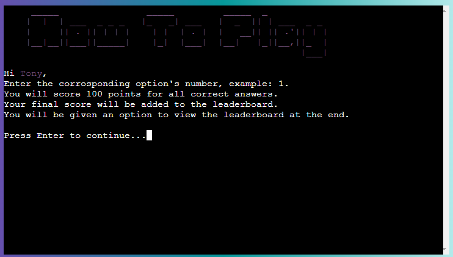

#### 5. Questions Section: 🔢 ❓

| **Test** | **Expectation** | **Result** |
| ------- | ------- | ------- |
| Press Enter to continue. | The previous text should clear. It will display the first question in magenta, the question and options in cyan and then request user input in white. Verify that the Question Index and Total Number of Questions are being displayed correctly in the the title, eg: 1 of 6. | ✅ Worked as expected |

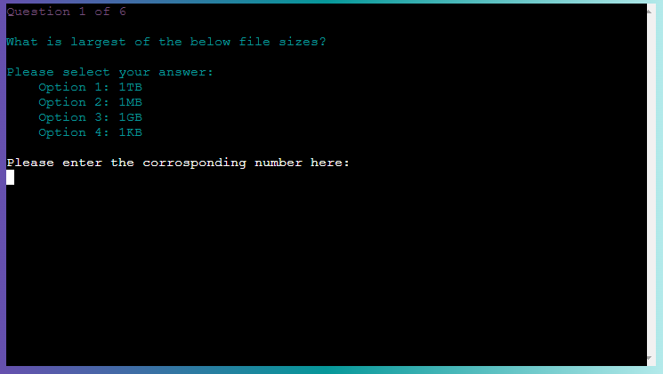

#### 6. Ivalid Question Input Section: 🛑 🔢 ⛔

| **Test** | **Expectation** | **Result** |
| ------- | ------- | ------- |
| Enter an invalid input, i.e. 0, a number greater than the number of corrosponding options asked or alphabetic letters. | The previous text should **NOT** clear. It will display the user's input data in red. It will clarify input requirments and loop the Question Input in white.  | ✅ Worked as expected |

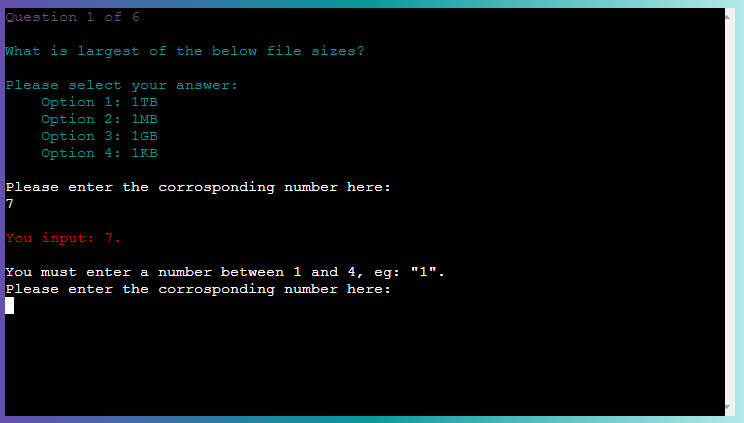

#### 7. Correct Answer Section: 🔢 ✔ 

| **Test** | **Expectation** | **Result** |
| ------- | ------- | ------- |
| Enter the correct answer. | The previous text should clear. It will display well done ascii art. It will congratulate the user and add 100 points to their score. It will display the user's current score. All text should be in green except the request to press Enter to continue. | ✅ Worked as expected |

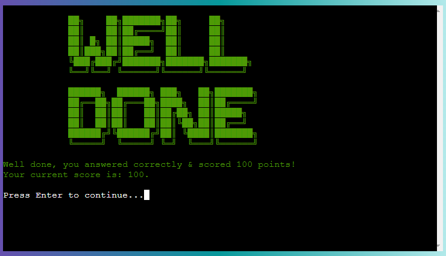

#### 8. Question Section Loop: 🔢 ❓ 🔁

| **Test** | **Expectation** | **Result** |
| ------- | ------- | ------- |
| Press Enter to continue. | The previous text should clear. It will display the next question in magenta, the question title should update to reflect this (eg. Question 2 of 6), the corrosponding question and options should be displayed in cyan and then request user input in white.| ✅ Worked as expected |

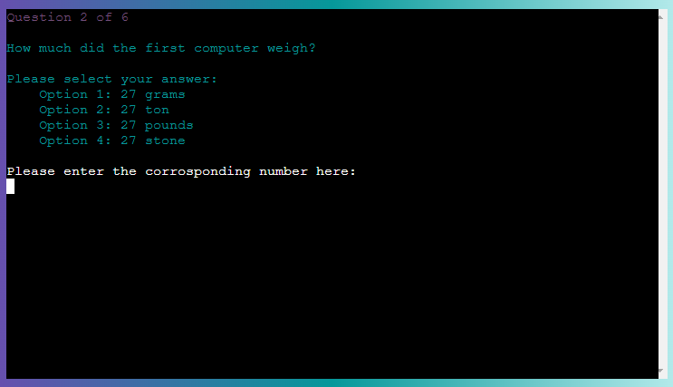

#### 9. Wrong Answer Section: 🔢 ❌

| **Test** | **Expectation** | **Result** |
| ------- | ------- | ------- |
| Enter an incorrect answer. | The previous text should **NOT** clear. It will state the following in red: user answer incorrect, the correct answer, they didnt score any points and their current points score. It will request press Enter to continue in white.  | ✅ Worked as expected |

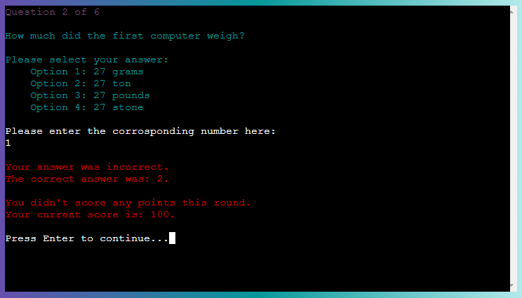

#### 10. End of Quiz Results Section: 🔚 🥇 🥈 🥉 🎰

| **Test** | **Expectation** | **Result** |
| ------- | ------- | ------- |
| Complete all questions in the quiz. | The previous text should clear. It will show "The End, Your Score:" ascii header with inverted colors (white background and black text). It will congratulate the user on making it to the end of the quiz in white. It will then provide different custom messages for the user based on their score, in red if they score below 50%, yellow if 50%, and green above 50%, there is also a different message for scoring 100%, you will need to complete the quiz multiple times with different total scores to test this. It will display the final score and request press Enter to continue in white.  | ✅ Worked as expected |

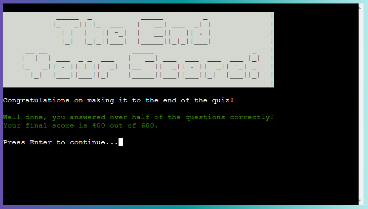

#### 11. Saved & Leaderboard Input Section: 💾 🏆

| **Test** | **Expectation** | **Result** |
| ------- | ------- | ------- |
| Press Enter to continue.| The previous text should clear. It will save the users result to the google sheet. It will show "Saved" ascii header in green and will state their username and score has been saved in white, both values should be displayed to the user. It will show "Leadboard" ascii header in yellow and will ask the user if they would like to view the high score leaderboard by entering y or n in white. | ✅ Worked as expected |

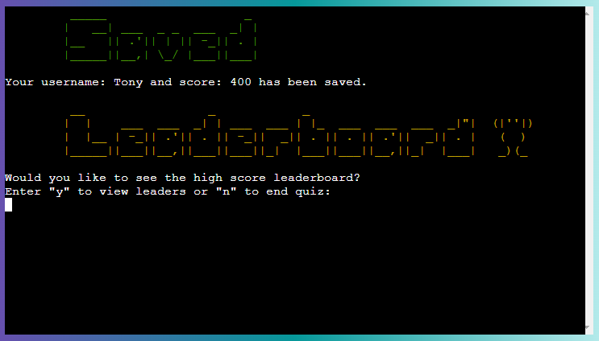

#### 12. Invalid Leaderboard Input Section: 🛑 👑 🏆 ⛔

| **Test** | **Expectation** | **Result** |
| ------- | ------- | ------- |
| Enter and ivalid input such as "t". | The previous text should clear. It will display the leaderboard header in yellow at the top, followed by the the user's input and clarification on requirements in red. It will then loop the Leaderboard Input Section again below in white. | ✅ Worked as expected |

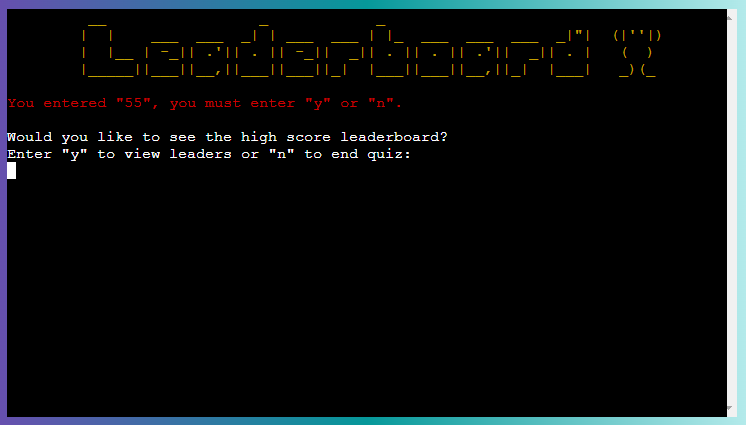

#### 13. Leaderboard Section: 👑 🥇 🥈 🥉 🏆

| **Test** | **Expectation** | **Result** |
| ------- | ------- | ------- |
| Enter y (or Y to test it will accept both) to continue to leaderboard. | The previous text should clear. It will display the leaderboard header in yellow at the top, followed by the top 15 high scores which include the user's rank, name and score in white. It will display Press Enter to Contine in white. | ✅ Worked as expected |

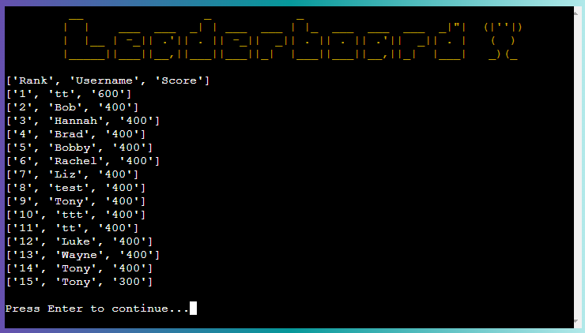

#### 14. Terminate Quiz Section (No to leaderboard): 🔚 🏁

| **Test** | **Expectation** | **Result** |
| ------- | ------- | ------- |
| Enter n (or N to test it will accept both) when asked if you would like to view the leaderboard (step 12) or click enter from the leaderboard (step 13) to terminate the app. | The previous text should clear. It will display red ascii header "Terminated Game Over" and then inform the user that they can restart the quiz by selecting the Run Program button again in white text. The app will no longer be responsive as it has terminated. | ✅ Worked as expected |

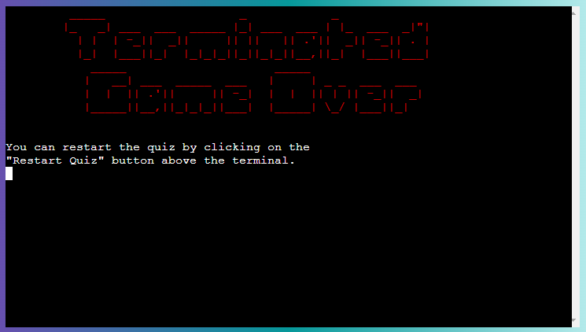

### Solved Bugs, Problems & Improvements: 🕵 🕷

I made some of the following changes during development to improve how the app functions / resolve issues: 

| **Issue** | **Solution** | **Image** |
| ------- | ------- | ------- |
| Overwhelming amount of text and no division between sections. | I imported and then used "os.system("clear")" to clear the page as appropiate to improve the user experience. | 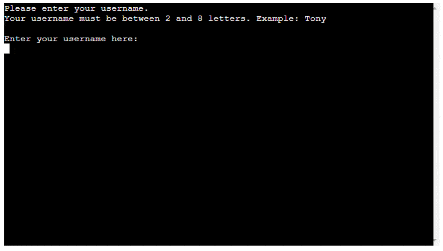 |
| The run.py file increased in length as the project progressed due to implementations such as the ascii art and color styles. Although relativly clear, I though it could have been improved after the file became larger than 400 lines. | To improve readability of the python code, I created seperate python files for the quiz functions, ascii art, color styles and quiz questions. This split the large file into multiple easier to read and maintain files. | 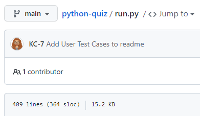 |
| Line Too Long (over 79 character). | I needed to seperate the lines to resolve these issues and paid attention when writing code to avoid going over the 79 character limit. | 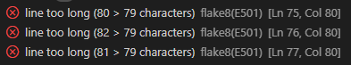 |
| Trailing white spaces became a reoccuring problem at the start. | I paid attention to try avoid this and regularly went through the highlighted problems to rectify at semi regular intervals. | 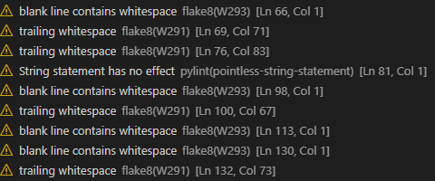 |
| Unnecessary Extra Function. | To reduce the amount of code, I merged the validation is numeric and within range function. | 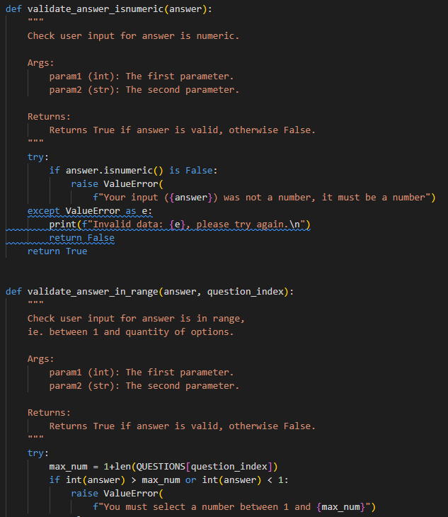 |
| Recursion in Restart Function. | I chose to remove this feature to avoid having a recusion in the code. In future, a while loop could be implemented to reintroduce this feature. | 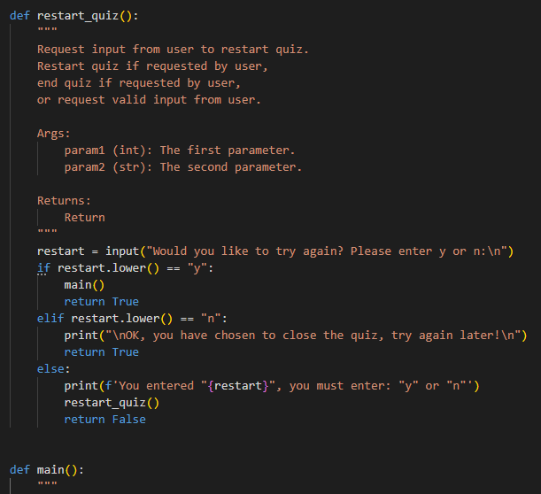 |
| Module not found error arose on the deployed heroku update after I implemented Colorama. | I resolved this issue by updating the requirements.txt file. | 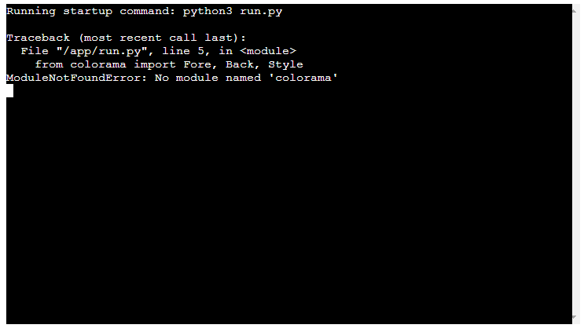 |
| The text background colour on the welcome page ascii logo did not look good as it was uneven and had a black gap. | I resolved this by adding a line on the right hand of the ascii art to create an even square border. | 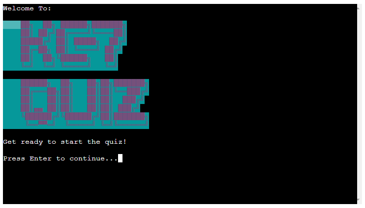 |
| I felt the appearance of the finished site felt incomplete. | To improve on this, I changed the color and text of the button above the terminal and centered the content. I added a gradient colour background. I also changed the webpage title and added a Favicon. I wanted to spend my time focusing on Python but I feel these small changes improved the finished project. | 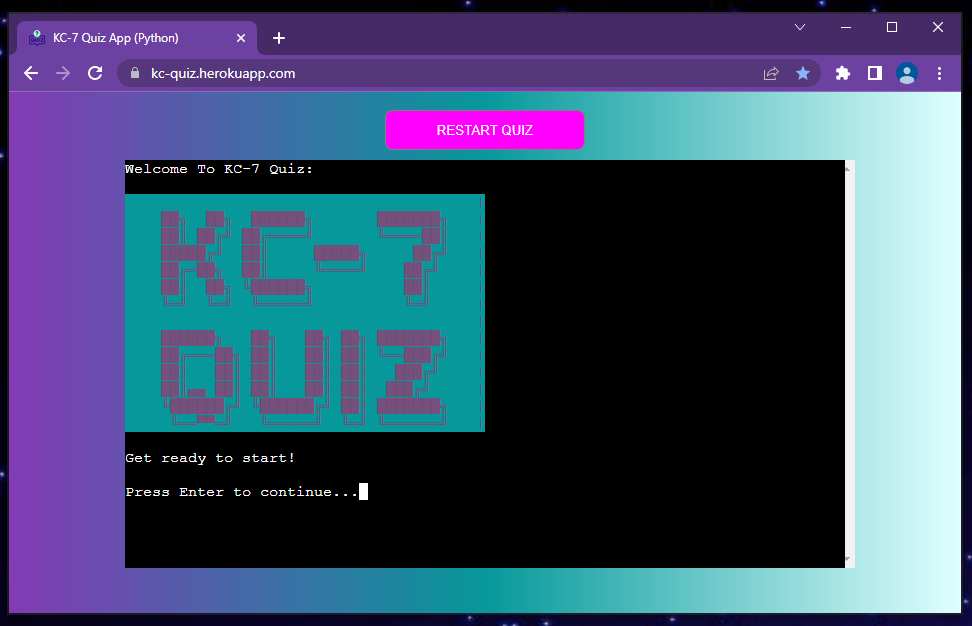 |
<!-- | xxx | xxx | Image | -->

### Remaining Bugs: 🔎 🐛 

I was not able to identify any further bugs during final testing however the colours displayed in the Heroku wep app terminal are not as vivid as when displayed in the Gitpod terminal. &#10004; 🐞 🦗

### Python Linter Testing: 🕵 🕷

I used the [Code Institute's Python Linter Heroku App](https://pep8ci.herokuapp.com/) to check for errors and received all clear results:

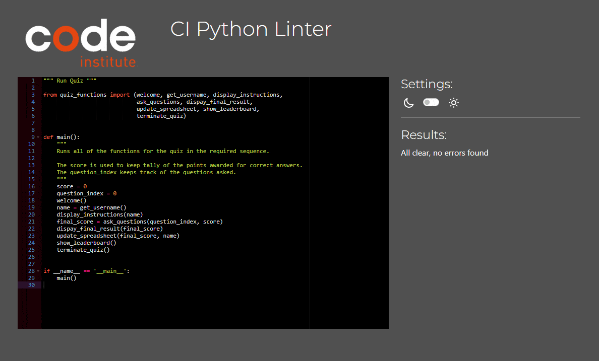

### GitPod Problems: 🔎

I cleared all highlighted problems excluding the below relating to the gitpod.yml file. There are no issues remaining for the Python Code.

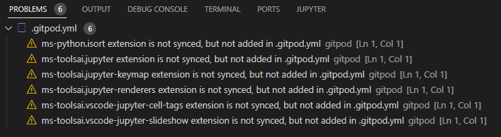

### Future Improvements: 🆕 💡 💭

- Create a statistics section at the end of the quiz to anaylize and display user data. Provide stats such as average user score and display a chart or graph in terminal. 📈
- Consider implementing a 30 second timer for each question. ⌛
- Add difficulty levels with different points, eg. 50 points correct answer on easy or 100 points on hard. 🔢
- Re-implement the internal restart quiz function without calling the main function and creating a recursion. 🔁
- Consider using an Emoji module to print emojis to terminal. 😁
- Randomise order of questions. 🔀

________________

## Deployment: 🌐

### GitPod: 🔧 ⌨

- I developed the site using Python in Gitpod. I accessed it via Gitpod workspaces instead of GitHub.

- I removed the creds.json file from being deployed to GitHub to keep it secure.

- I tested the site during development by entering the following command into the terminal: 
    - *python3 run.py*

- For version control, I regularly updated my work to **GitHub** by entering the below commands into the terminal: 
    - *git add .*
    - *git commit -m "Update message here"*
    - *git push*

### Creating the Heroku app: 🌐 🖱

- I deployed the app to Heroku by doing the following: 
    1. Add \n to the end of each input request (due to known issue when deploying CI template to Heroku)
    2. Update list of depandancies in requirements.txt by entering ***"pip3 freeze > requirements.txt"***
    3. Create new app in the Heroku dashboard (region set to Europe)
    4. Go to settings --> Config Vars --> Create New Config Var: 
        - Set Key to "CREDS" & copy the code from the creds.json fie and paste all of it as the Value and select add
        - Create additional Config Var, set key to "Port" and Value to "8000" and select add
    5. Add the following buildpacks in the settings section by selecting and saving in this order:
        - Python
        - NodeJS
    6. Go to Deploy --> Deployment Method --> Select GitHub and connect.
    7. Search for project and connect to respository.
    8. Enable Automatic Deploys

________________

## Credits: 🥂 🙏 👀

| **Resource:** | **Reason:** |
| ------- | ------- |
| [The Code Institute's Gitpod Python Terminal Window Template](https://github.com/Code-Institute-Org/python-essentials-template) | Used as the initial template for this project so that the Python code can be deployed on a web page. |
| [The Code Institute's Love Sandwhiches Python Project](https://github.com/KC-7/love-sandwiches) | This project was a good source to reference for information such as implementing the main function, linking to the google sheet and uploading to Heroku. |
| [My CI Mentor, Rohit](https://codeinstitute.net/) | I found my three calls with Rohit very informative and benifical to my learning. |
| [pypi.org's Colorama Guide](https://pypi.org/project/colorama/) | This guide showed me how to import and use Colorama to change the foregroud and background colors for printed text in the terminal. |
| [CSS Gradient](https://cssgradient.io/) | was used to generate the code for the background colour in CSS using my chosen my HEX colours. |
| [Patorjk's Ascii Generator](https://patorjk.com/software/taag/#p=display&f=Graffiti&t=KC7%20) | This was used to generate the custom ascii art headings. |
| [Flaticon](https://www.flaticon.com/free-icon/quiz_5705146?term=quiz&page=1&position=38&origin=tag&related_id=5705146) | The Favicon logo was provided by Flaticon. |
| [GeeksForGeeks](https://www.geeksforgeeks.org/what-does-the-if-__name__-__main__-do/) | I learned how to implement if name = main by reading this guide. |
| [Scaler](https://www.scaler.com/topics/how-to-clear-screen-in-python/) | I learned how to clear the screen in Python by reading this how to guide. |
| [EZ GIF](https://ezgif.com/) | was used to create the gifs in this readme file. |
| [Programiz](https://www.programiz.com/python-programming/class-object) | I used this guide to learn how to implement classes in Python. |
<!-- | [xxxxx]() | xxxxx | -->
________________

Thanks for reading!